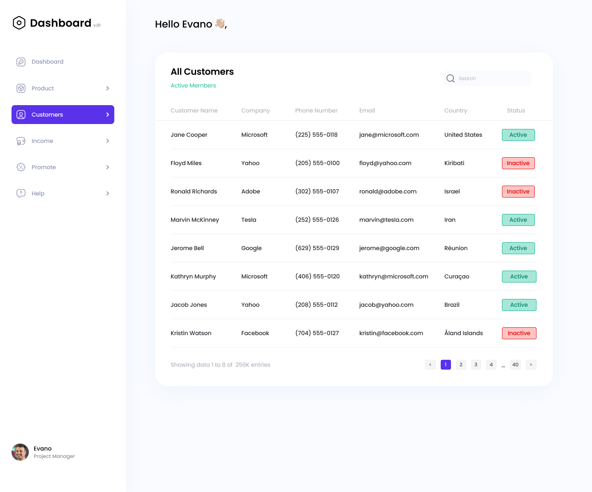

# Dashboard

## 

This project is a test assignment that I have completed, which required me to
develop a React application with a specific set of requirements.

List of requirements for the project:

- Cross-browser compatibility
- Adaptive design
- Semantic markup
- Pixel-perfect design
- The mobile version is required, with design up to the developer's discretion
- Search functionality that searches across all fields
- Fast and accurate search results
- Built using React library
- Pagination is not required for this project
- Routing is not required for this project.
